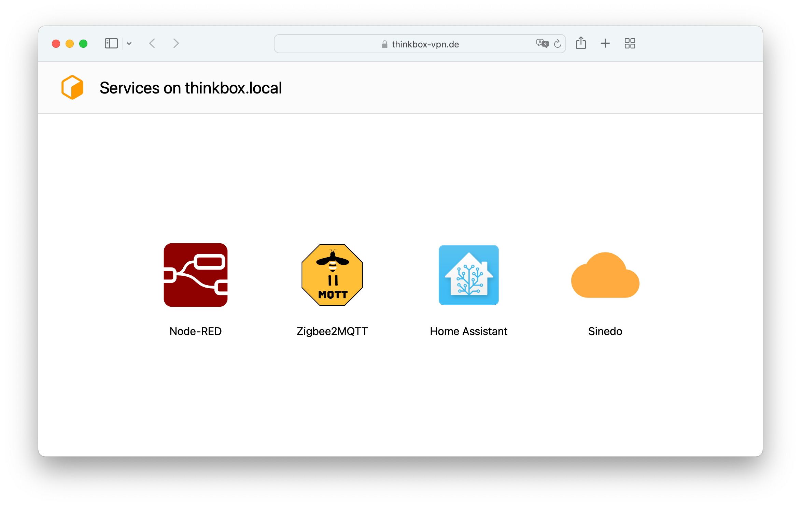

# thinkbox-vpn.de
A small overview page about services running on my server, fork it and add your own services :)

## Features

A short list of what features the front-end offers.

<b>Supported device classes:</b> 
✅ Small smartphones 
✅ Smartphones 
✅ Tablets 
✅ Laptops 
✅ Desktops 
❌ Foldable devices 
❌ Handhelds 

<b>Supported views:</b> 
✅ Night view 
✅ Day view 
✅ High contrast view (1)

<b>High-DPI support:</b> 
✅ Yes - only SVGs are used (2) 

<b>Multilanguage:</b> 
❌ No - English only 

<b>External dependencies:</b> 
✅ None 

 

(1)
High contrast view is for people with low vision. Activate the `forced-colors` scheme under `More Tools -> Rendering` in Chrome Dev Tools to get a preview. 
The colors used are determined by the browser, see at W3C CSS Color Module Level 4 - [6.2. System Colors](https://www.w3.org/TR/css-color-4/#css-system-colors).

 

(2)
Some application icons are not available as vector graphics, they have been redrawn and may differ slightly from the manufacturer's icon. See [icon-node-red.svg](/images/icon-node-red.svg) as an example, I also upload customized files to [this](https://worldvectorlogo.com/logo/node-red-2) page.

## Licence

This project is licensed under MIT - See the [LICENSE](/LICENSE) file for more information.

---

&uarr; [Back to top](#thinkbox-vpnde)