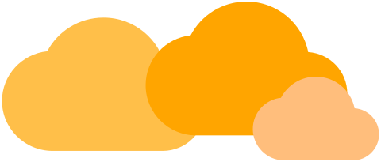
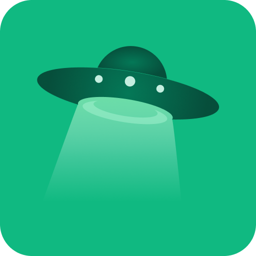

# thinkbox.center
  

A small overview page of services hosted under my domain. Feel free to fork it and add your own services.

## Features

A short list of what features the front-end offers.

<b>Supported device classes:</b> 
✅ Small smartphones 
✅ Smartphones 
✅ Tablets 
✅ Laptops 
✅ Desktops 
❌ Foldable devices 
❌ Handhelds 

<b>Supported views:</b> 
✅ Night view 
✅ Day view 
✅ High contrast view (1)

<b>High-DPI support:</b> 
✅ Yes - only SVGs are used (2) 

<b>Multilanguage:</b> 
❌ No - English only 

<b>External dependencies:</b> 
✅ None 

 

(1)
High contrast view is for people with low vision. Activate the `forced-colors` scheme under `More Tools -> Rendering` in Chrome Dev Tools to get a preview. 
The colors used are determined by the browser, see at W3C CSS Color Module Level 4 - [6.2. System Colors](https://www.w3.org/TR/css-color-4/#css-system-colors).

 

(2)
Vector images were used whenever possible, some application icons are from [Simple Icons](https://simpleicons.org/) and were manually post-processed. See [Zigbee2MQTT](https://github.com/patbec/thinkbox.center/blob/f6a5288f53e902a0a1a430dea4d855bf444f1367/src/images/apps/zigbee2mqtt.svg?short_path=c657464) or [Node-RED](https://github.com/patbec/thinkbox.center/blob/f6a5288f53e902a0a1a430dea4d855bf444f1367/src/images/apps/nodered.svg?short_path=cdbf839) as an example, the vector code was reduced and cleaned up.

## App icons

Symbols used on this page.

<table wit>
	<tr>
		<th>Name</th>
		<th>Icon</th>
 	</tr>
 	<tr>
  	<td>
			<a href="https://nodered.org">Node-RED</a>
		</td>
   	<td align="center">
      </img>
    </td>
 	</tr>
 	<tr>
  	<td>
			<a href="https://www.zigbee2mqtt.io">Zigbee2MQTT</a>
		</td>
   	<td align="center">
      </img>
    </td>
 	</tr>
 	<tr>
  	<td>
			<a href="https://grafana.com">Grafana</a>
		</td>
		<td align="center">
			</img>
		</td>
 	</tr>
 	<tr>
  	<td>
			<a href="https://www.portainer.io">Portainer</a>
		</td>
		<td align="center">
			</img>
		</td>
 	</tr>
 	<tr>
  	<td>
			<a href="https://www.home-assistant.io">Home Assistant</a>
		</td>
   	<td align="center">
			</img>
		</td>
 	</tr>
 	<tr>
  	<td>
			<a href="https://hoppscotch.io">Hoppscotch</a>
		</td>
		<td align="center">
			</img>
		</td>
 	</tr>
</table>

## Setup

These services are only accessible via <b>VPN</b>, the subdomain <i>(bsp. grafana.thinkbox.center)</i> returns a private IP address. Routers usually filter such requests via the [DNS rebind](https://en.wikipedia.org/wiki/DNS_rebinding) protection function.

## Licence

This project is licensed under MIT - See the [LICENSE](/LICENSE) file for more information.

---

&uarr; [Back to top](#thinkboxcenter)
