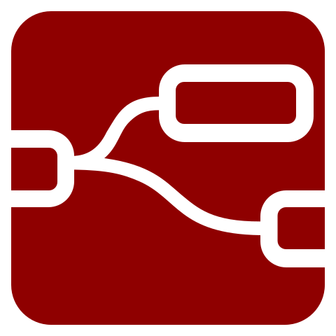
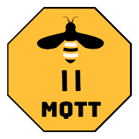

# thinkbox-vpn.de
A small overview page about services running on my server, fork it and add your own services :)

## Features

A short list of what features the front-end offers.

<b>Supported device classes:</b> 
✅ Small smartphones 
✅ Smartphones 
✅ Tablets 
✅ Laptops 
✅ Desktops 
❌ Foldable devices 
❌ Handhelds 

<b>Supported views:</b> 
✅ Night view 
✅ Day view 
✅ High contrast view (1)

<b>High-DPI support:</b> 
✅ Yes - only SVGs are used (2) 

<b>Multilanguage:</b> 
❌ No - English only 

<b>External dependencies:</b> 
✅ None 

 

(1)
High contrast view is for people with low vision. Activate the `forced-colors` scheme under `More Tools -> Rendering` in Chrome Dev Tools to get a preview. 
The colors used are determined by the browser, see at W3C CSS Color Module Level 4 - [6.2. System Colors](https://www.w3.org/TR/css-color-4/#css-system-colors).

 

(2)
Some application icons are not available as vector graphics, they have been redrawn and may differ slightly from the manufacturer's icon. See [icon-node-red.svg](/images/icon-node-red.svg) as an example, I also upload customized files to [this](https://worldvectorlogo.com/logo/node-red-2) page.

## App icons

Symbols used on this page.

<table wit>
	<tr>
		<th>Name</th>
		<th>Type</th>
		<th>Icon</th>
 	</tr>
 	<tr>
  		<td>
			<a href="https://nodered.org">Node-RED</a>
		</td>
  		<td>SVG</td>
   		<td>
            </img>
        </td>
 	</tr>
 	<tr>
  		<td>
			<a href="https://www.zigbee2mqtt.io">Zigbee2MQTT</a>
		</td>
  		<td>PNG</td>
   		<td>
            </img>
        </td>
 	</tr>
 	<tr>
  		<td>
			<a href="https://grafana.com">Grafana</a>
		</td>
  		<td>SVG</td>
   		<td>
            </img>
        </td>
 	</tr>
 	<tr>
  		<td>
			<a href="https://www.portainer.io">Portainer</a>
		</td>
  		<td>SVG</td>
   		<td>
            </img>
        </td>
 	</tr>
 	<tr>
  		<td>
			<a href="https://github.com/patbec/Sinedo">Sinedo</a>
		</td>
  		<td>SVG</td>
   		<td>
            </img>
        </td>
 	</tr>
 	<tr>
  		<td>
			<a href="https://www.home-assistant.io">Home Assistant</a>
		</td>
  		<td>SVG with embedded PNG</td>
   		<td>
            </img>
        </td>
 	</tr>
 	<tr>
  		<td>
			<a href="https://hoppscotch.io">Hoppscotch</a>
		</td>
		<td>PNG</td>
   		<td>
            </img>
        </td>
 	</tr>
</table>

## Licence

This project is licensed under MIT - See the [LICENSE](/LICENSE) file for more information.

---

&uarr; [Back to top](#thinkbox-vpnde)